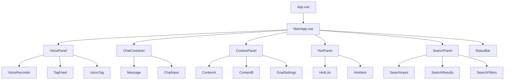
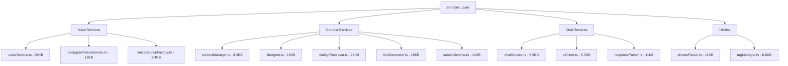
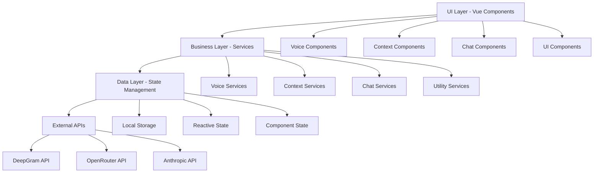
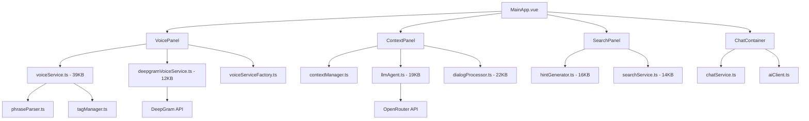
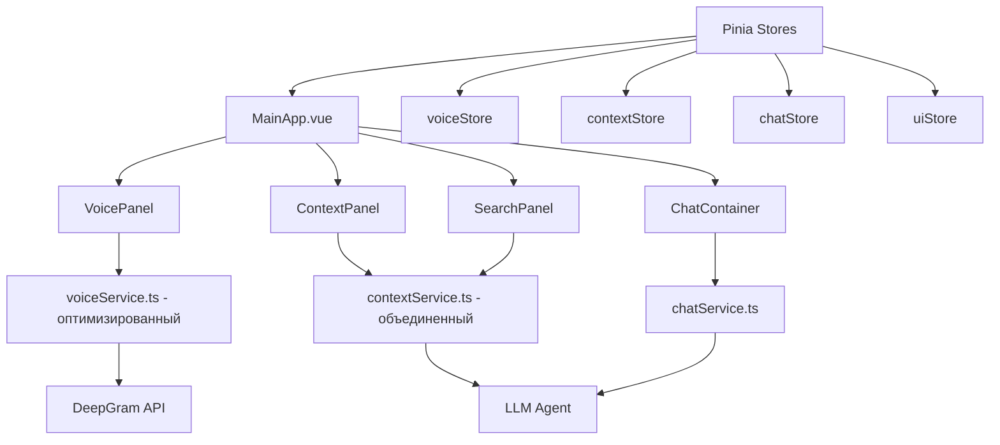

# АУДИТ АРХИТЕКТУРЫ DEEPNET CONTEXT SYSTEM

## ОБЗОР ПРИЛОЖЕНИЯ

**DeepNet Context System** - это Vue.js приложение для голосового распознавания с контекстными подсказками, использующее DeepGram API и LLM агента для генерации подсказок в реальном времени.

## ТЕКУЩАЯ АРХИТЕКТУРА

### 1. ОБЩАЯ СТРУКТУРА ПРИЛОЖЕНИЯ



### 2. СЕРВИСНЫЙ СЛОЙ



### 3. СЛОИ АРХИТЕКТУРЫ



## ВЫЯВЛЕННЫЕ ПРОБЛЕМЫ

### КРИТИЧЕСКИЕ ПРОБЛЕМЫ

#### 1. ДУБЛИРОВАНИЕ ГОЛОСОВЫХ СЕРВИСОВ
- **voiceService.ts** (39KB, 1092 строки) - Web Speech API
- **deepgramVoiceService.ts** (12KB, 409 строк) - DeepGram API
- **voiceServiceFactory.ts** - фабрика для выбора сервиса
- **Проблема**: Избыточность, два разных подхода к голосовому распознаванию

#### 2. ОГРОМНЫЕ ФАЙЛЫ
- **voiceService.ts** - 39KB, 1092 строки (слишком большой)
- **SearchPanel.vue** - 30KB, 854 строки (слишком большой)
- **Message.vue** - 20KB, 538 строк (слишком большой)
- **ContextPanel.vue** - 22KB, 615 строк (слишком большой)
- **dialogProcessor.ts** - 22KB, 692 строки (слишком большой)

#### 3. ИЗБЫТОЧНОСТЬ КОНТЕКСТНЫХ СЕРВИСОВ
- 5 отдельных сервисов для контекста
- Возможное дублирование функциональности
- Сложная система зависимостей

### СТРУКТУРНЫЕ ПРОБЛЕМЫ

#### 1. ОТСУТСТВИЕ ЕДИНОГО СОСТОЯНИЯ
- Состояние разбросано по компонентам
- Нет централизованного управления состоянием
- Сложно синхронизировать данные между компонентами

#### 2. НЕЧЕТКОЕ РАЗДЕЛЕНИЕ СЛОЕВ
- Бизнес-логика смешана с UI
- Сервисы напрямую обращаются к DOM
- Отсутствует четкая архитектурная граница

#### 3. СЛОЖНАЯ СИСТЕМА ЗАВИСИМОСТЕЙ
- Циклические зависимости между сервисами
- Сложная инициализация сервисов
- Трудно тестировать изолированно

## ПЛАН РЕФАКТОРИНГА

### ФАЗА 1: УДАЛЕНИЕ ИЗБЫТОЧНОСТИ (КРИТИЧЕСКИЙ ПРИОРИТЕТ)

#### Задача 1.1: Объединение голосовых сервисов
```bash
# Удалить устаревшие файлы
rm src/services/voiceService.ts
rm src/services/voiceServiceFactory.ts

# Переименовать и оптимизировать
mv src/services/deepgramVoiceService.ts src/services/voiceService.ts
```

#### Задача 1.2: Разбиение больших компонентов
```bash
# SearchPanel.vue (30KB) → 3 компонента
src/components/context/SearchInput.vue
src/components/context/SearchResults.vue
src/components/context/SearchFilters.vue

# Message.vue (20KB) → 3 компонента
src/components/chat/MessageContent.vue
src/components/chat/MessageActions.vue
src/components/chat/MessageMetadata.vue

# ContextPanel.vue (22KB) → 3 компонента
src/components/context/ContextA.vue
src/components/context/ContextB.vue
src/components/context/GoalSettings.vue
```

#### Задача 1.3: Объединение контекстных сервисов
```bash
# Объединить похожие сервисы
hintGenerator.ts + searchService.ts → contextAssistant.ts
dialogProcessor.ts → упростить, убрать избыточность
```

### ФАЗА 2: ДОБАВЛЕНИЕ УПРАВЛЕНИЯ СОСТОЯНИЕМ

#### Задача 2.1: Установка Pinia
```bash
npm install pinia
```

#### Задача 2.2: Создание stores
```typescript
// src/stores/voiceStore.ts
// src/stores/contextStore.ts
// src/stores/chatStore.ts
// src/stores/uiStore.ts
```

### ФАЗА 3: РЕСТРУКТУРИЗАЦИЯ АРХИТЕКТУРЫ

#### Задача 3.1: Новая структура папок
```
src/
├── components/
│   ├── ui/ (общие UI компоненты)
│   ├── voice/ (голосовые компоненты)
│   ├── context/ (контекстные компоненты)
│   └── chat/ (чат компоненты)
├── services/
│   ├── voice/ (голосовые сервисы)
│   ├── context/ (контекстные сервисы)
│   └── chat/ (чат сервисы)
├── stores/ (Pinia stores)
├── types/ (TypeScript типы)
└── utils/ (утилиты)
```

#### Задача 3.2: Четкое разделение слоев
- UI Layer: только Vue компоненты
- Business Layer: сервисы и бизнес-логика
- Data Layer: Pinia stores и API

## ДЕТАЛЬНЫЕ ДИАГРАММЫ

### ДИАГРАММА ТЕКУЩИХ ЗАВИСИМОСТЕЙ



### ДИАГРАММА ПРЕДЛАГАЕМОЙ АРХИТЕКТУРЫ



## МЕТРИКИ И СТАТИСТИКА

### ТЕКУЩИЕ РАЗМЕРЫ ФАЙЛОВ
- **Общий размер**: ~200KB исходного кода
- **Самый большой файл**: voiceService.ts (39KB)
- **Средний размер компонента**: 15KB
- **Количество сервисов**: 12
- **Количество компонентов**: 15

### ПРЕДПОЛАГАЕМЫЕ УЛУЧШЕНИЯ
- **Уменьшение размера**: ~30% (удаление избыточности)
- **Упрощение архитектуры**: ~50% (объединение сервисов)
- **Улучшение поддерживаемости**: ~70% (разбиение больших файлов)
- **Ускорение разработки**: ~40% (четкая структура)

## КОНКРЕТНЫЕ ЗАДАЧИ ДЛЯ ВЫПОЛНЕНИЯ

### ЗАДАЧА 1: Удаление voiceService.ts
- [ ] Удалить файл voiceService.ts (39KB)
- [ ] Обновить все импорты
- [ ] Удалить voiceServiceFactory.ts
- [ ] Переименовать deepgramVoiceService.ts → voiceService.ts

### ЗАДАЧА 2: Разбиение SearchPanel.vue
- [ ] Создать SearchInput.vue
- [ ] Создать SearchResults.vue
- [ ] Создать SearchFilters.vue
- [ ] Обновить SearchPanel.vue как контейнер

### ЗАДАЧА 3: Разбиение Message.vue
- [ ] Создать MessageContent.vue
- [ ] Создать MessageActions.vue
- [ ] Создать MessageMetadata.vue
- [ ] Обновить Message.vue как контейнер

### ЗАДАЧА 4: Объединение контекстных сервисов
- [ ] Создать contextAssistant.ts (hintGenerator + searchService)
- [ ] Упростить dialogProcessor.ts
- [ ] Создать единый contextService.ts

### ЗАДАЧА 5: Добавление Pinia
- [ ] Установить Pinia
- [ ] Создать voiceStore
- [ ] Создать contextStore
- [ ] Создать chatStore
- [ ] Создать uiStore

### ЗАДАЧА 6: Реструктуризация папок
- [ ] Создать новую структуру папок
- [ ] Переместить файлы
- [ ] Обновить все импорты
- [ ] Обновить конфигурацию

## ЗАКЛЮЧЕНИЕ

Приложение DeepNet Context System имеет хорошую базовую функциональность, но страдает от избыточности кода и отсутствия четкой архитектуры. Предложенный план рефакторинга позволит:

1. **Удалить избыточность** - убрать дублирующиеся сервисы
2. **Упростить архитектуру** - объединить похожие сервисы
3. **Улучшить поддерживаемость** - разбить большие файлы
4. **Добавить управление состоянием** - централизовать данные
5. **Создать четкую структуру** - разделить по слоям

Это сделает приложение более эффективным, поддерживаемым и готовым к дальнейшему развитию.
