# ДИАГРАММЫ АРХИТЕКТУРЫ DEEPNET CONTEXT SYSTEM

## 1. ОБЩАЯ АРХИТЕКТУРА ПРИЛОЖЕНИЯ

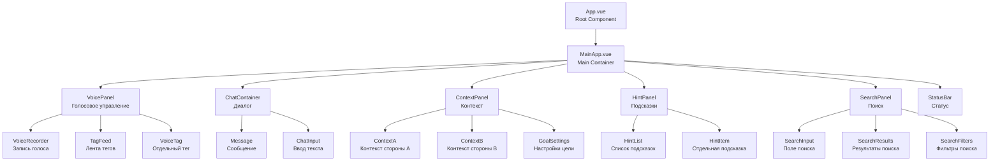

## 2. СЕРВИСНЫЙ СЛОЙ

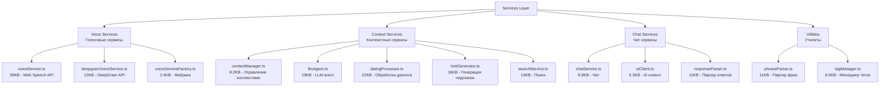

## 3. СЛОИ АРХИТЕКТУРЫ

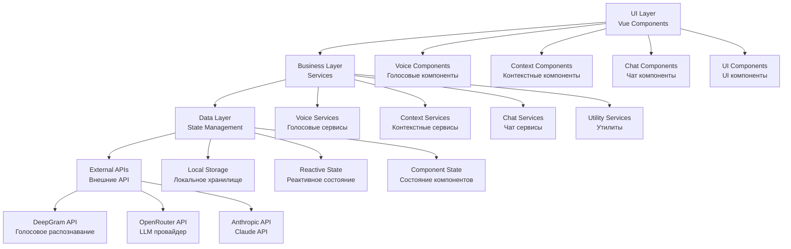

## 4. ТЕКУЩИЕ ЗАВИСИМОСТИ

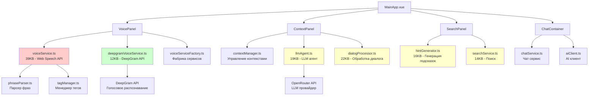

## 5. ПРЕДЛАГАЕМАЯ АРХИТЕКТУРА

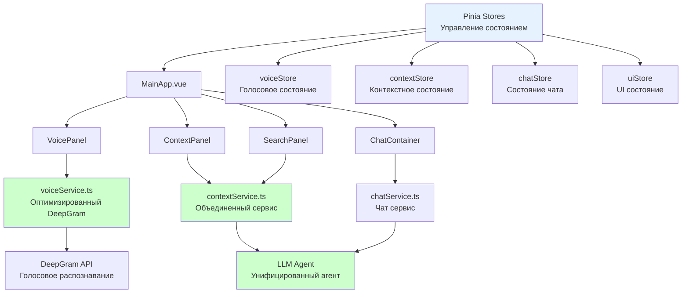

## 6. СТРУКТУРА ПАПОК (ТЕКУЩАЯ)

```mermaid
graph TD
    A[src/] --> B[components/]
    A --> C[services/]
    A --> D[types/]
    A --> E[utils/]
    A --> F[config/]
    A --> G[styles/]
    
    B --> B1[voice/]
    B --> B2[context/]
    B --> B3[hover/]
    B --> B4[MainApp.vue]
    B --> B5[Message.vue]
    B --> B6[ChatInput.vue]
    B --> B7[ChatContainer.vue]
    B --> B8[OptionsPanel.vue]
    B --> B9[TextSelectionTooltip.vue]
    
    B1 --> B1A[VoicePanel.vue]
    B1 --> B1B[VoiceRecorder.vue]
    B1 --> B1C[TagFeed.vue]
    B1 --> B1D[VoiceTag.vue]
    
    B2 --> B2A[ContextPanel.vue]
    B2 --> B2B[HintPanel.vue]
    B2 --> B2C[SearchPanel.vue]
    
    C --> C1[voiceService.ts - 39KB]
    C --> C2[deepgramVoiceService.ts - 12KB]
    C --> C3[voiceServiceFactory.ts]
    C --> C4[chatService.ts]
    C --> C5[aiClient.ts]
    C --> C6[responseParser.ts]
    C --> C7[phraseParser.ts]
    C --> C8[tagManager.ts]
    C --> C9[context/]
    C --> C10[providers/]
    
    C9 --> C9A[contextManager.ts]
    C9 --> C9B[llmAgent.ts - 19KB]
    C9 --> C9C[dialogProcessor.ts - 22KB]
    C9 --> C9D[hintGenerator.ts - 16KB]
    C9 --> C9E[searchService.ts - 14KB]
    C9 --> C9F[index.ts]
    
    D --> D1[context.d.ts]
    D --> D2[deepgram.d.ts]
    D --> D3[voice.d.ts]
    D --> D4[ai.ts]
    D --> D5[chat.ts]
```

## 7. СТРУКТУРА ПАПОК (ПРЕДЛАГАЕМАЯ)

```mermaid
graph TD
    A[src/] --> B[components/]
    A --> C[services/]
    A --> D[stores/]
    A --> E[types/]
    A --> F[utils/]
    A --> G[config/]
    A --> H[styles/]
    
    B --> B1[ui/]
    B --> B2[voice/]
    B --> B3[context/]
    B --> B4[chat/]
    
    B1 --> B1A[MainApp.vue]
    B1 --> B1B[OptionsPanel.vue]
    B1 --> B1C[TextSelectionTooltip.vue]
    B1 --> B1D[StatusBar.vue]
    
    B2 --> B2A[VoicePanel.vue]
    B2 --> B2B[VoiceRecorder.vue]
    B2 --> B2C[TagFeed.vue]
    B2 --> B2D[VoiceTag.vue]
    
    B3 --> B3A[ContextPanel.vue]
    B3 --> B3B[ContextA.vue]
    B3 --> B3C[ContextB.vue]
    B3 --> B3D[GoalSettings.vue]
    B3 --> B3E[HintPanel.vue]
    B3 --> B3F[HintList.vue]
    B3 --> B3G[HintItem.vue]
    B3 --> B3H[SearchPanel.vue]
    B3 --> B3I[SearchInput.vue]
    B3 --> B3J[SearchResults.vue]
    B3 --> B3K[SearchFilters.vue]
    
    B4 --> B4A[ChatContainer.vue]
    B4 --> B4B[Message.vue]
    B4 --> B4C[MessageContent.vue]
    B4 --> B4D[MessageActions.vue]
    B4 --> B4E[MessageMetadata.vue]
    B4 --> B4F[ChatInput.vue]
    
    C --> C1[voice/]
    C --> C2[context/]
    C --> C3[chat/]
    
    C1 --> C1A[voiceService.ts]
    C1 --> C1B[phraseParser.ts]
    C1 --> C1C[tagManager.ts]
    
    C2 --> C2A[contextService.ts]
    C2 --> C2B[llmAgent.ts]
    C2 --> C2C[dialogProcessor.ts]
    
    C3 --> C3A[chatService.ts]
    C3 --> C3B[aiClient.ts]
    C3 --> C3C[responseParser.ts]
    
    D --> D1[voiceStore.ts]
    D --> D2[contextStore.ts]
    D --> D3[chatStore.ts]
    D --> D4[uiStore.ts]
```

## 8. ПОТОК ДАННЫХ В ПРИЛОЖЕНИИ

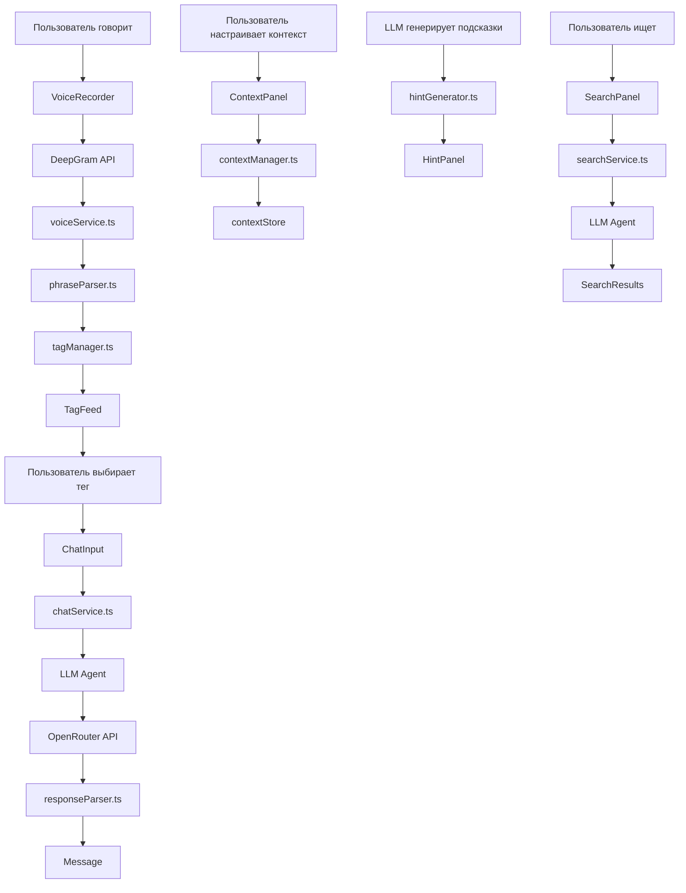

## 9. ПРОБЛЕМЫ И РЕШЕНИЯ

### КРИТИЧЕСКИЕ ПРОБЛЕМЫ

```mermaid
graph TD
    A[Проблемы] --> B[Дублирование голосовых сервисов]
    A --> C[Огромные файлы]
    A --> D[Избыточность контекстных сервисов]
    A --> E[Отсутствие управления состоянием]
    A --> F[Нечеткое разделение слоев]
    
    B --> B1[voiceService.ts - 39KB Web Speech API]
    B --> B2[deepgramVoiceService.ts - 12KB DeepGram API]
    B --> B3[voiceServiceFactory.ts - Фабрика]
    
    C --> C1[SearchPanel.vue - 30KB, 854 строки]
    C --> C2[Message.vue - 20KB, 538 строк]
    C --> C3[ContextPanel.vue - 22KB, 615 строк]
    C --> C4[dialogProcessor.ts - 22KB, 692 строки]
    
    D --> D1[5 отдельных сервисов для контекста]
    D --> D2[Возможное дублирование функциональности]
    D --> D3[Сложная система зависимостей]
    
    E --> E1[Состояние разбросано по компонентам]
    E --> E2[Нет централизованного управления]
    E --> E3[Сложно синхронизировать данные]
    
    F --> F1[Бизнес-логика смешана с UI]
    F --> F2[Сервисы напрямую обращаются к DOM]
    F --> F3[Отсутствует четкая архитектурная граница]
```

### РЕШЕНИЯ

```mermaid
graph TD
    A[Решения] --> B[Объединить голосовые сервисы]
    A --> C[Разбить большие файлы]
    A --> D[Объединить контекстные сервисы]
    A --> E[Добавить Pinia stores]
    A --> F[Четко разделить слои]
    
    B --> B1[Удалить voiceService.ts]
    B --> B2[Переименовать deepgramVoiceService.ts → voiceService.ts]
    B --> B3[Удалить voiceServiceFactory.ts]
    
    C --> C1[SearchPanel → SearchInput + SearchResults + SearchFilters]
    C --> C2[Message → MessageContent + MessageActions + MessageMetadata]
    C --> C3[ContextPanel → ContextA + ContextB + GoalSettings]
    C --> C4[Упростить dialogProcessor.ts]
    
    D --> D1[hintGenerator + searchService → contextAssistant.ts]
    D --> D2[Создать единый contextService.ts]
    D --> D3[Упростить зависимости]
    
    E --> E1[voiceStore - голосовое состояние]
    E --> E2[contextStore - контекстное состояние]
    E --> E3[chatStore - состояние чата]
    E --> E4[uiStore - UI состояние]
    
    F --> F1[UI Layer - только Vue компоненты]
    F --> F2[Business Layer - сервисы и бизнес-логика]
    F --> F3[Data Layer - Pinia stores и API]
```

## 10. МЕТРИКИ И СТАТИСТИКА

### ТЕКУЩИЕ РАЗМЕРЫ

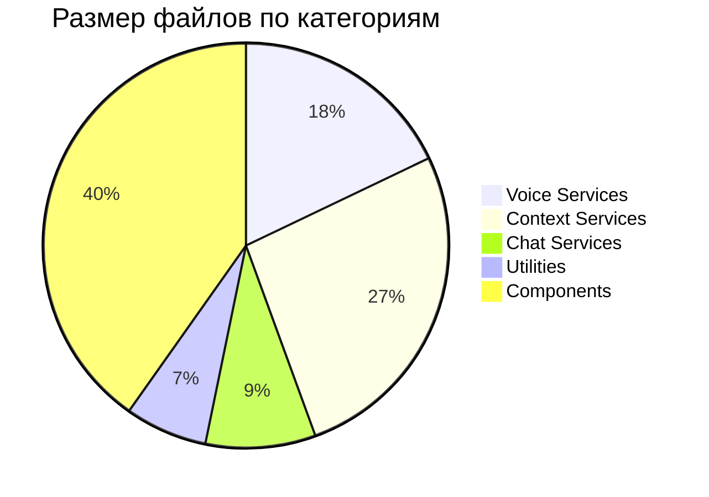

### ПРЕДПОЛАГАЕМЫЕ УЛУЧШЕНИЯ

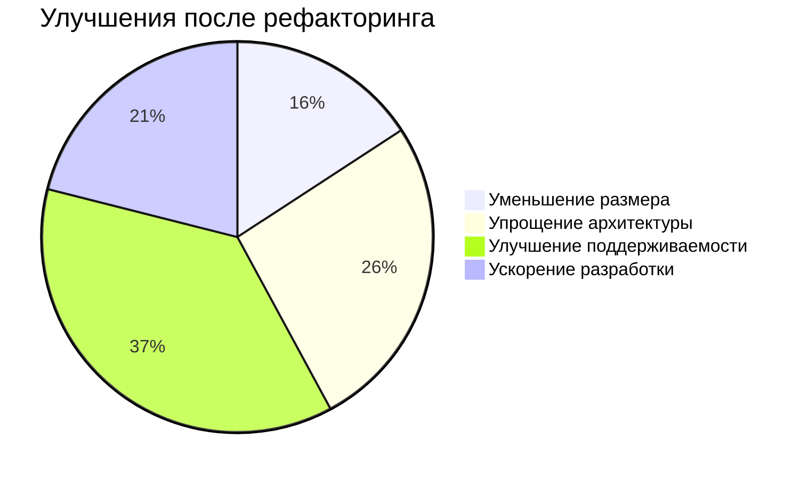

## ЗАКЛЮЧЕНИЕ

Диаграммы показывают текущее состояние архитектуры DeepNet Context System и предлагаемые улучшения. Основные проблемы:

1. **Избыточность** - дублирование голосовых сервисов
2. **Сложность** - слишком большие файлы и компоненты
3. **Отсутствие структуры** - нет четкого разделения слоев
4. **Управление состоянием** - разбросанное состояние

Предложенные решения позволят создать более эффективную, поддерживаемую и масштабируемую архитектуру.
