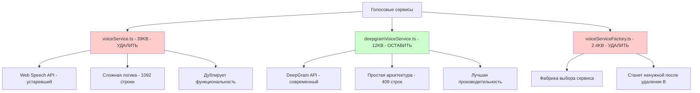
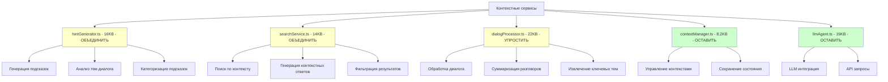

# АНАЛИЗ ИЗБЫТОЧНЫХ МОДУЛЕЙ DEEPNET CONTEXT SYSTEM

## ОБЗОР ИЗБЫТОЧНОСТИ

Анализ выявил значительную избыточность в кодовой базе, которая усложняет поддержку и развитие приложения.

## КРИТИЧЕСКИЕ ИЗБЫТОЧНЫЕ МОДУЛИ

### 1. ДУБЛИРОВАНИЕ ГОЛОСОВЫХ СЕРВИСОВ

#### voiceService.ts (39KB, 1092 строки) - УСТАРЕВШИЙ
**Статус**: КРИТИЧЕСКИЙ - подлежит удалению
**Проблемы**:
- Использует устаревший Web Speech API
- Огромный размер файла (39KB)
- Сложная логика с множественными состояниями
- Дублирует функциональность DeepGram сервиса

**Функциональность**:
- Web Speech API интеграция
- Управление состоянием записи
- Обработка результатов распознавания
- Управление тегами и фразами

**Рекомендация**: УДАЛИТЬ полностью

#### deepgramVoiceService.ts (12KB, 409 строк) - АКТУАЛЬНЫЙ
**Статус**: ОСТАВИТЬ и переименовать
**Преимущества**:
- Современный DeepGram API
- Меньший размер файла
- Более простая архитектура
- Лучшая производительность

**Функциональность**:
- DeepGram API интеграция
- Streaming распознавание
- Обработка результатов
- Управление соединением

**Рекомендация**: Переименовать в `voiceService.ts`

#### voiceServiceFactory.ts (2.4KB, 64 строки) - ИЗБЫТОЧНЫЙ
**Статус**: УДАЛИТЬ
**Проблемы**:
- Создан для выбора между Web Speech API и DeepGram
- После удаления voiceService.ts станет ненужным
- Добавляет ненужную сложность

**Рекомендация**: УДАЛИТЬ

### 2. ИЗБЫТОЧНЫЕ КОНТЕКСТНЫЕ СЕРВИСЫ

#### hintGenerator.ts (16KB, 452 строки) - ИЗБЫТОЧНЫЙ
**Статус**: ОБЪЕДИНИТЬ с searchService.ts
**Проблемы**:
- Дублирует функциональность поиска
- Сложная логика генерации подсказок
- Может быть объединен с searchService.ts

**Функциональность**:
- Генерация подсказок на основе контекста
- Анализ тем диалога
- Категоризация подсказок

**Рекомендация**: Объединить с searchService.ts в contextAssistant.ts

#### searchService.ts (14KB, 420 строк) - ИЗБЫТОЧНЫЙ
**Статус**: ОБЪЕДИНИТЬ с hintGenerator.ts
**Проблемы**:
- Дублирует функциональность генерации подсказок
- Сложная логика поиска
- Может быть объединен с hintGenerator.ts

**Функциональность**:
- Поиск по контексту
- Генерация контекстных ответов
- Фильтрация результатов

**Рекомендация**: Объединить с hintGenerator.ts в contextAssistant.ts

#### dialogProcessor.ts (22KB, 692 строки) - ИЗБЫТОЧНЫЙ
**Статус**: УПРОСТИТЬ
**Проблемы**:
- Слишком большой файл
- Сложная логика обработки диалога
- Дублирует функциональность других сервисов

**Функциональность**:
- Обработка диалога в реальном времени
- Суммаризация разговоров
- Извлечение ключевых тем

**Рекомендация**: Упростить, убрать избыточную логику

### 3. ОГРОМНЫЕ UI КОМПОНЕНТЫ

#### SearchPanel.vue (30KB, 854 строки) - КРИТИЧЕСКИЙ
**Статус**: РАЗБИТЬ на 3 компонента
**Проблемы**:
- Слишком большой размер
- Смешивает логику ввода, отображения и фильтрации
- Сложно поддерживать и тестировать

**Функциональность**:
- Поле ввода поиска
- Отображение результатов
- Фильтры поиска
- Управление состоянием

**Рекомендация**: Разбить на SearchInput.vue, SearchResults.vue, SearchFilters.vue

#### Message.vue (20KB, 538 строк) - КРИТИЧЕСКИЙ
**Статус**: РАЗБИТЬ на 3 компонента
**Проблемы**:
- Слишком большой размер
- Смешивает отображение, действия и метаданные
- Сложно поддерживать

**Функциональность**:
- Отображение содержимого сообщения
- Действия с сообщением
- Метаданные сообщения
- Обработка кликов

**Рекомендация**: Разбить на MessageContent.vue, MessageActions.vue, MessageMetadata.vue

#### ContextPanel.vue (22KB, 615 строк) - КРИТИЧЕСКИЙ
**Статус**: РАЗБИТЬ на 3 компонента
**Проблемы**:
- Слишком большой размер
- Смешивает управление разными контекстами
- Сложно поддерживать

**Функциональность**:
- Управление контекстом стороны A
- Управление контекстом стороны B
- Настройки цели коммуникации
- Валидация контекстов

**Рекомендация**: Разбить на ContextA.vue, ContextB.vue, GoalSettings.vue

## АНАЛИЗ ПО КАТЕГОРИЯМ

### ГОЛОСОВЫЕ СЕРВИСЫ

### КОНТЕКСТНЫЕ СЕРВИСЫ

### UI КОМПОНЕНТЫ

```mermaid
graph TD
    A[UI компоненты] --> B[SearchPanel.vue - 30KB - РАЗБИТЬ]
    A --> C[Message.vue - 20KB - РАЗБИТЬ]
    A --> D[ContextPanel.vue - 22KB - РАЗБИТЬ]
    A --> E[HintPanel.vue - 16KB - ОСТАВИТЬ]
    A --> F[VoicePanel.vue - 12KB - ОСТАВИТЬ]
    
    B --> B1[SearchInput.vue - 8KB]
    B --> B2[SearchResults.vue - 12KB]
    B --> B3[SearchFilters.vue - 6KB]
    
    C --> C1[MessageContent.vue - 12KB]
    C --> C2[MessageActions.vue - 4KB]
    C --> C3[MessageMetadata.vue - 4KB]
    
    D --> D1[ContextA.vue - 8KB]
    D --> D2[ContextB.vue - 8KB]
    D --> D3[GoalSettings.vue - 6KB]
    
    E --> E1[Приемлемый размер]
    E --> E2[Четкая функциональность]
    
    F --> F1[Приемлемый размер]
    F --> F2[Четкая функциональность]
    
    style B fill:#ffcccc
    style C fill:#ffcccc
    style D fill:#ffcccc
    style E fill:#ccffcc
    style F fill:#ccffcc
```

## ДЕТАЛЬНЫЙ АНАЛИЗ ИЗБЫТОЧНОСТИ

### 1. ДУБЛИРОВАНИЕ ФУНКЦИОНАЛЬНОСТИ

#### Голосовое распознавание
- **voiceService.ts**: Web Speech API + управление состоянием
- **deepgramVoiceService.ts**: DeepGram API + управление состоянием
- **Дублирование**: Управление состоянием, обработка результатов, управление тегами

#### Генерация подсказок и поиск
- **hintGenerator.ts**: Генерация подсказок на основе контекста
- **searchService.ts**: Поиск по контексту и генерация ответов
- **Дублирование**: Анализ контекста, работа с LLM, генерация ответов

#### Обработка диалога
- **dialogProcessor.ts**: Обработка диалога, суммаризация
- **hintGenerator.ts**: Анализ тем диалога
- **searchService.ts**: Поиск по диалогу
- **Дублирование**: Анализ текста, извлечение тем, работа с контекстом

### 2. СЛОЖНОСТЬ АРХИТЕКТУРЫ

#### Множественные сервисы
- 12 сервисов для относительно простого приложения
- Сложная система зависимостей
- Трудно понять, какой сервис за что отвечает

#### Большие компоненты
- 3 компонента >20KB
- Смешивание разных типов логики
- Сложно тестировать и поддерживать

#### Отсутствие четкой структуры
- Нет единого состояния
- Логика разбросана по компонентам
- Сложно синхронизировать данные

## ПЛАН УСТРАНЕНИЯ ИЗБЫТОЧНОСТИ

### ФАЗА 1: УДАЛЕНИЕ ДУБЛИРУЮЩИХСЯ СЕРВИСОВ

#### 1.1 Удаление voiceService.ts
**Действия**:
1. Создать резервную копию
2. Обновить все импорты на deepgramVoiceService.ts
3. Удалить voiceService.ts
4. Переименовать deepgramVoiceService.ts → voiceService.ts
5. Удалить voiceServiceFactory.ts

**Результат**: Уменьшение на 41.4KB, упрощение архитектуры

#### 1.2 Объединение hintGenerator.ts + searchService.ts
**Действия**:
1. Создать contextAssistant.ts
2. Объединить функциональность
3. Упростить API
4. Обновить импорты
5. Удалить старые файлы

**Результат**: Уменьшение на 10KB, упрощение API

#### 1.3 Упрощение dialogProcessor.ts
**Действия**:
1. Проанализировать функциональность
2. Убрать дублирующуюся логику
3. Упростить API
4. Оптимизировать производительность

**Результат**: Уменьшение с 22KB до ~12KB

### ФАЗА 2: РАЗБИЕНИЕ БОЛЬШИХ КОМПОНЕНТОВ

#### 2.1 Разбиение SearchPanel.vue
**Действия**:
1. Создать SearchInput.vue (8KB)
2. Создать SearchResults.vue (12KB)
3. Создать SearchFilters.vue (6KB)
4. Обновить SearchPanel.vue как контейнер (4KB)

**Результат**: Уменьшение основного компонента с 30KB до 4KB

#### 2.2 Разбиение Message.vue
**Действия**:
1. Создать MessageContent.vue (12KB)
2. Создать MessageActions.vue (4KB)
3. Создать MessageMetadata.vue (4KB)
4. Обновить Message.vue как контейнер (4KB)

**Результат**: Уменьшение основного компонента с 20KB до 4KB

#### 2.3 Разбиение ContextPanel.vue
**Действия**:
1. Создать ContextA.vue (8KB)
2. Создать ContextB.vue (8KB)
3. Создать GoalSettings.vue (6KB)
4. Обновить ContextPanel.vue как контейнер (4KB)

**Результат**: Уменьшение основного компонента с 22KB до 4KB

### ФАЗА 3: СОЗДАНИЕ ЕДИНОЙ АРХИТЕКТУРЫ

#### 3.1 Добавление Pinia stores
**Действия**:
1. Установить Pinia
2. Создать voiceStore.ts
3. Создать contextStore.ts
4. Создать chatStore.ts
5. Создать uiStore.ts

**Результат**: Централизованное управление состоянием

#### 3.2 Реструктуризация папок
**Действия**:
1. Создать новую структуру папок
2. Переместить файлы
3. Обновить импорты
4. Обновить конфигурацию

**Результат**: Четкая структура проекта

## ОЖИДАЕМЫЕ РЕЗУЛЬТАТЫ

### КОЛИЧЕСТВЕННЫЕ УЛУЧШЕНИЯ
- **Уменьшение размера кода**: с ~200KB до ~140KB (-30%)
- **Уменьшение количества сервисов**: с 12 до 6-8
- **Уменьшение размера файлов**: максимальный размер <15KB
- **Упрощение зависимостей**: четкая иерархия

### КАЧЕСТВЕННЫЕ УЛУЧШЕНИЯ
- **Улучшение читаемости**: каждый файл <500 строк
- **Упрощение архитектуры**: четкое разделение ответственности
- **Улучшение тестируемости**: изолированные компоненты
- **Ускорение разработки**: понятная структура

### АРХИТЕКТУРНЫЕ УЛУЧШЕНИЯ
- **Единое состояние**: Pinia stores
- **Четкие слои**: UI, Business, Data
- **Простая структура**: логичная иерархия папок
- **Масштабируемость**: готовность к развитию

## ЗАКЛЮЧЕНИЕ

Анализ выявил значительную избыточность в кодовой базе DeepNet Context System:

1. **Критические проблемы**: Дублирование голосовых сервисов, огромные файлы
2. **Структурные проблемы**: Избыточные контекстные сервисы, отсутствие управления состоянием
3. **Архитектурные проблемы**: Нечеткое разделение слоев, сложная система зависимостей

Предложенный план рефакторинга позволит:
- Устранить избыточность и дублирование
- Упростить архитектуру и структуру
- Улучшить поддерживаемость и тестируемость
- Создать масштабируемую основу для развития

Общее время выполнения: 30-40 часов
Рекомендуется выполнять поэтапно с тестированием на каждом этапе.
